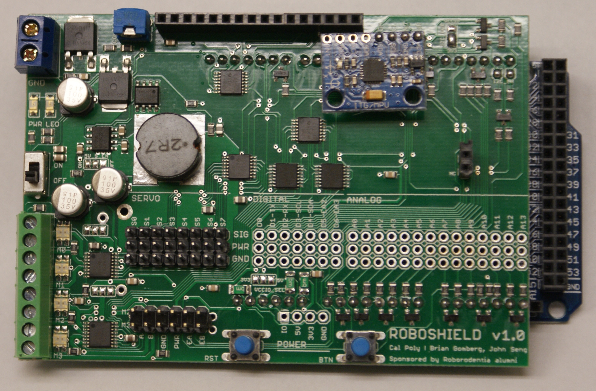

The Roboshield is distributed as a kit and will need to be assembled.  All the surface mount components have already been soldered to the board.  The only assembly required is for the through-hole components.

(board shown above without female digital/analog headers)

### Part List

* 3 x 40-pin male headers (for servos, 6-pin motor headers, and power header)
* 3 x 40-pin female headers (for digital/analog I/O)
* 1 x 16-pin female headers (for LCD connector on shield)
* 4 green 2-pin block terminals (connect together before soldering)
* 1 blue 2-pin block terminal
* 1 potentiometer for LCD contrast adjustment
* 1 power switch
* 2 pushbutton switches

### Soldering Tips

* When soldering the servo headers, use the female headers to keep the male servo headers aligned.  If the headers are not aligned, it will be difficult to plug in servos.

* Use the same alignment technique when soldering the female analog and digital headers.

* When soldering headers in general, solder one pin first and then check the header alignment.  If the header is straight and flush with the board, then solder the remaining pins.

* Pins that are connected to GND will be connected to the ground plane on the bottom of the board.  These pins will require more heat in order for the solder to flow properly.
