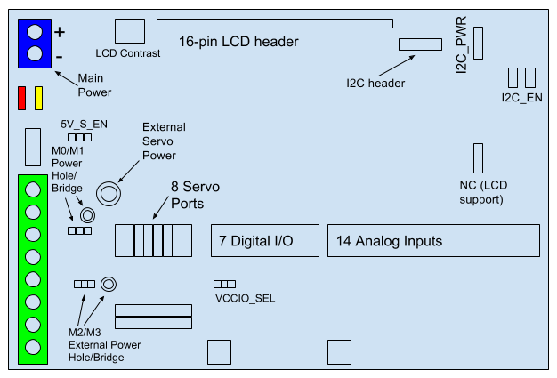

### Roboshield Pinout

---

### Applying Power

Main power (7-15V) for the Roboshield is applied through the main power terminals (upper left corner).  

**Never** apply power to the Arduino Mega barrel jack when using the Roboshield.  This will short the power terminals and the barrel jack.

7-15V may be applied and by default, this voltage is sent directly to the motor drivers and is regulated to 5V (8A maximum current) for the servos.  NOTE: when applying a voltage above 10V, the Arduino Mega 5V regulator will become hot, but will be functional.

>#### External Servo Power
>
>The on-board servo power regulator can be disabled by cutting the left trace of the solder bridge labeled 5V_S_EN.
>
>A wire plugged into the hole near the S0 label will apply power to the servos.

>#### External Motor Power
>
>There are 2 traces that can be cut to disconnect the H-bridge power.  Each trace is part of a solder bridge and after cutting each of these traces, a wire can be soldered to the appropriate hole to connect an external power supply to the motors. 

---

### 6-pin Motor Headers

The Roboshield supports 6-pin Pololu motor headers.  The motor connector should be plugged in with the Red wire towards the left side of the board (connected to pin A).  The White wire should be connected to pin EB.  

Only 1 pin of the quadrature encoders are read by the software library (the EA pin) and only the rising edge of the pin is used in counting rotation.  The EB pin is accessible via a solder hole to the right of the pin.

---

### I2C Functionality

Digital pins 3 and 4 are shared with the SCL and SDA pins.  These pins are labeled D3-SCL and D4-SDA.  If both I2C_EN solder bridges are shorted, digital input/output functionality is not available for these pins.  

---

### GY-521 (MPU6050 Accelerometer/Gyroscope Breakout Board)

In order to use the GY-521, configure the following options on the Roboshield:

* Each I2C_EN solder bridge must be closed
* The I2C_PWR solder bridge must be shorted to 3V3

You will need a 4-pin male header to attach the breakout board to the Roboshield.  Solder the header to the pins: SDA, SCL, GND, and VCC on the GY-521.

When using the GY-521, digital pins D3 and D4 will not be available for use.

---

### Known Bugs

There are currently no known bugs.

